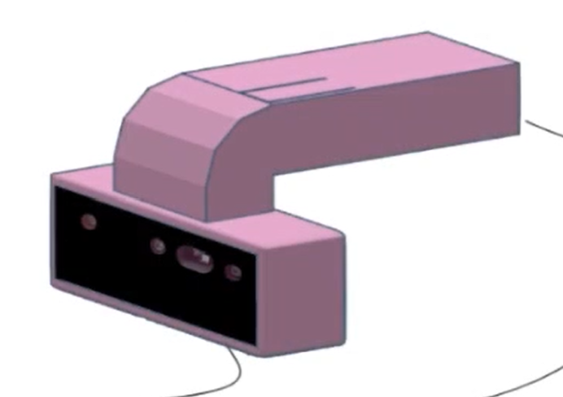

# Converting Depth Image to Sound

This graduation project explores the transformation of depth images into auditory cues to assist blind and visually impaired individuals with obstacle detection and avoidance during walking.
Depth images provide grayscale encodings of spatial information: the brighter a pixel (color value approaching 255 representing the color white), the closer the object is to the camera. Inversely, darker pixels indicate greater distance.

## To begin

It will be needed to to do installation.
For the code to function but also for the camera to work.
It will be needed to have :
 - 3 USB Ports
 - headphones
 - The Camera RGB-D
 - The computer's mouse
 - The cane ( support )
For our case we have printed with a 3D printer a support dedicated for our use (Image below, the pink color is the support and the black color is the camera).




## Installation for the code 

Install the library opencv.

```bash
pip install opencv-python
```
Install the library numpy.  
```bash
pip install numpy
```
Do the same for the library pygame, pydub

It is also needed to install depthai: https://github.com/luxonis/depthai  

And others needed libraries.


## Usage

1. Installation of materials 

    To use the cane, it is needed to insert the camera the space dedicated to it in the cane. It would be also necessary to put the mouse in the cane such as the left click is under the boutton printed for it.
    Connected the mouse cable on computer via USB port. Do the same for the camera and the headphone. All to a same computer in which the librairies are installed and Visual Studio is availble

2. How to use the code 

    Use the main.py file provided to execute the program. 
    All is provided in the code. And the device should be operational.  
    A .wav file should be create in the folder in where the program is executed.  
    A .png is also crate in the same folder: it is the camera picture after the mask is applied.

 
## Video Explenation

[Watch the full demo video](https://youtu.be/0kMOdFrgxwQ)


## Authors ( M2 EEA: IPS - MSR)

- Christine CHEN 
- Chanborina TIENG
- Jieli XIA


